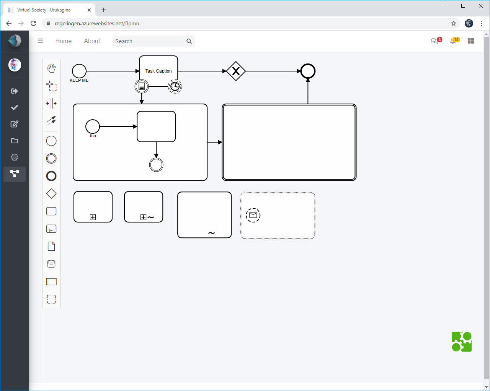
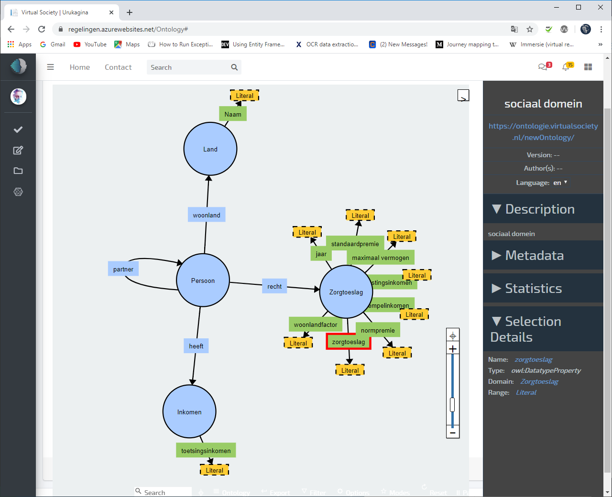

#  Virtual Society

## UX / Component Library

Voor UX ontwerpen wij schermen op codepen.io voordat zij opgenomen worden in het Blazor framework. Blazor is een gratis en open-source webframework waarmee ontwikkelaars webapps kunnen maken met C # en HTML. WebVOWL en OWL2VOWL worden beide vrijgegeven onder de MIT-licentie.

### Burger kant

De burgerkant is een eigen ontworpen bootstrap layout. Deze layouts worden in mobile-first ontworpen. De layouts kun je terugvinden op de onderstaande URL:

https://sjefvanleeuwen.github.io/virtual-society-urukagina/doc/ux/component-library/index.html

### Professional kant

Voor de professional kant gebruiken wij één van de beste open source admin dashboard & control componenten. AdminLTE is gebouwd bovenop Bootstrap en biedt een reeks responsieve, herbruikbare en veelgebruikte componenten.

Admin-LTE kun je vinden op de volgende URL: https://adminlte.io/

Daarnaast integreren wij bestaande rijke design surfaces, zoals hieronder aangegeven:

#### BPMN process management (bpmn.io)

Dit betreft een componenten om in de web browser BPM diagrammen te kunnen ontwerpen volgens de BPMN 2.0 specificatie. Zij wordt gebruikt om processen achter de applicatie te kunnen executeren middels de Camunda process engine. Deze open source workflow- en beslissingsautomatiseringstools stellen tienduizenden ontwikkelaars in staat om bedrijfsprocessen te automatiseren en de behendigheid, zichtbaarheid en schaal te krijgen die nodig is om digitale transformatie te bereiken.

Camunda kun je vinden op de volgende URL: https://camunda.com/

#### Ontologie (WebVOWL)

WebVOWL is een webapplicatie voor de interactieve visualisatie van ontologieën. Het implementeert de visuele notatie voor OWL Ontologies (VOWL) door grafische afbeeldingen te leveren voor elementen van de Web Ontology Language (OWL) die worden gecombineerd tot een op kracht gerichte grafische lay-out die de ontologie weergeeft. Interactietechnieken maken het mogelijk om de ontologie te verkennen en de visualisatie aan te passen. De VOWL-visualisaties worden automatisch gegenereerd uit JSON-bestanden waarin de ontologieën moeten worden geconverteerd. Een Web-gebaseerde OWL2VOWL-converter wordt meegeleverd met WebVOWL.

#### Script Editor

Voor scripting wordt veelal gebruik gemaakt van YAML. YAML is een voor mensen leesbare data-serialisatie taal. Het wordt vaak gebruikt voor configuratiebestanden en in toepassingen waar gegevens worden opgeslagen of verzonden. We gebruiken YAML omdat het voor mensen gemakkelijker is om te lezen en te schrijven dan andere veelgebruikte gegevensindelingen zoals XML of JSON. Verder zijn er in de meeste programmeertalen bibliotheken beschikbaar voor het werken met YAML.

YAML wordt vervolgens geschreven in een editor, genaamd Monaco, welke het schrijven in YAML vereenvoudigd.

kun je vinden op de volgende URL: https://microsoft.github.io/monaco-editor/
